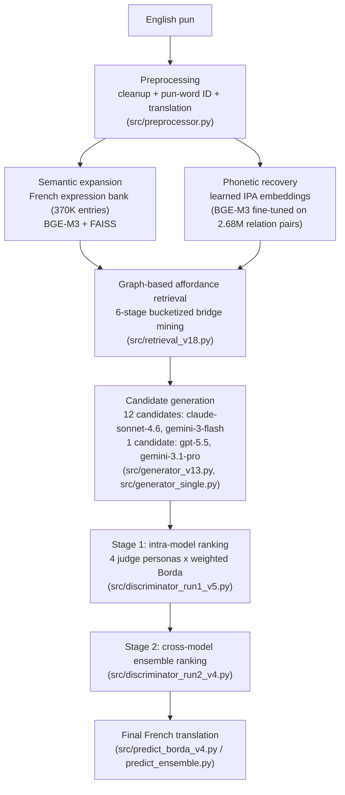

# DS@GT ARC CLEF 2026 JOKER Task 2 Pun Translation

Georgia Tech's DS@GT ARC submission to [Task 2 (pun translation)](https://www.joker-project.com/) of the [CLEF 2026 JOKER lab](https://clef2026.clef-initiative.eu/): translating English puns into French while preserving — or recreating — the wordplay.

FAISS-indexed dense retrieval over a 370K-entry French expression bank and a BGE-M3 embedding model fine-tuned on 2.7M IPA phonetic relations surfaces sound–meaning *affordances* — target-language bridges that may support new wordplay. Claude, Gemini, and GPT compete as generators to build candidate translations around them. A two-stage ranking pipeline, with four LLM-judge personas (Comedian, Linguist, Editor, Translator) voting by weighted Borda count, selects the winner.

Full method and analysis are in the working notes: *Searching for Sound-Meaning Collisions: Graph-Based Affordance Retrieval and Multi-Evaluator Ranking for Pun Translation at CLEF 2026 JOKER Task 2* (Taylor, Brikman, Awate — see [Citation](#citation)).

## Findings

- Retrieval coverage grew from 14% to 50.8% of source puns relative to the [2025 DS@GT ARC system](#citation), by adding the French expression bank and the trained phonetic embedding model.
- Generators actively exploit retrieved affordances, and evaluators progressively concentrate around the strongest sound–meaning bridges as candidates move through the pipeline.
- Exact phonological "same-sound" affordances make up only 10.8% of retrieved candidates but 27.5% of final selected winners — rare, exact sound correspondences are disproportionately valuable once found.
- Despite tripling retrieval coverage, roughly half of source puns still yield no usable affordance, indicating retrieval remains the central bottleneck in computational pun translation.
- Scored first on the public automatic-metric leaderboard at working-notes time (37.783).

## How the system works



1. **Preprocessing** — clean source text, identify the pun word/type, and translate its two semantic domains ([`src/preprocessor.py`](src/preprocessor.py)).
2. **Affordance retrieval** — expand each semantic domain via dense retrieval over a French expression bank (Wiktionary + PARSEME + OpenSubtitles collocations) and a learned phonetic embedding space, then mine phonetic "bridges" between the two domains across 6 ordered retrieval stages, rank, and prune ([`src/retrieval/expressions/`](src/retrieval/expressions/), [`src/retrieval/phonetic/`](src/retrieval/phonetic/), [`src/retrieval_v18.py`](src/retrieval_v18.py)).
3. **Candidate generation** — generate 12 competing French pun candidates per source pun with `claude-sonnet-4.6` and `gemini-3-flash` (guided but not constrained by retrieved affordances), plus one candidate each from `gpt-5.5` and `gemini-3.1-pro` ([`src/generator_v13.py`](src/generator_v13.py), [`src/generator_single.py`](src/generator_single.py)).
4. **Two-stage ranking** — four judge personas (Comedian, Linguist, Editor, Translator) independently rank candidates; weighted Borda voting picks a per-generator Stage 1 winner, then a Stage 2 cross-model ensemble ranks all four generators' winners against each other ([`src/discriminator_run1_v5.py`](src/discriminator_run1_v5.py), [`src/discriminator_run2_v4.py`](src/discriminator_run2_v4.py)).
5. **Prediction / submission** — assemble the final run file from the ranking output ([`src/predict_borda_v4.py`](src/predict_borda_v4.py), [`src/predict_single_v2.py`](src/predict_single_v2.py), [`src/predict_ensemble.py`](src/predict_ensemble.py)).

See [`docs/overview.md`](docs/overview.md) for the earlier step-by-step design notes this system grew out of.

## Repository structure

```
root/
├── src/                    # 2026 pipeline (see "How the system works")
│   ├── retrieval/
│   │   ├── expressions/    # build the French expression bank + FAISS index
│   │   └── phonetic/       # build the phonetic relevance dataset, train/index the phonetic embedding model
│   ├── config.py           # reads config.ini into typed paths/model aliases
│   └── ...                 # preprocessor, generator, discriminator, predict, metrics/stats scripts
├── archive/                 # superseded code kept for reference only — not used by the 2026 pipeline
│   ├── 2025-previous/      # the 2023/2025 CLEF Joker pipeline this system evolved from
│   └── scripts/            # earlier iterations of reporting/eval scripts (see archive/README.md)
├── data/
│   ├── 2023/, 2025/, 2026/ # official JOKER task input data
│   ├── processed/          # pipeline intermediate/output tsvs (identify, translate, retrieval, generate, discriminate, predict, ...)
│   ├── retrieval/          # expression bank + phonetic retrieval artifacts (large binaries gitignored — see below)
│   ├── fasttext/           # pretrained fastText vectors (gitignored — see below)
│   └── lexique/            # Lexique383.tsv, a French phonetic lexicon (download from lexique.org)
├── notebooks/               # exploratory notebooks (EDA, A/B evaluation, training)
├── tests/
├── docs/
├── config.ini               # model aliases + data paths read by src/config.py
└── user/                    # per-user scratch directory, not for shared code
```

`archive/` holds code that is no longer part of the active pipeline but is kept for reference (provenance, ablation comparisons, "what did we try before"). Nothing in `src/` imports from it.

## Setup

```bash
python3 -m venv .venv
source .venv/bin/activate
pip install --upgrade pip
pip install -r requirements.txt
# only needed for building/training retrieval artifacts (FAISS, phonetic embedding model):
pip install -r requirements-retrieval.txt
pip install -e .
```

Set the OpenRouter API key used by `src/config.py` for all LLM calls:

```bash
export OPENROUTER_API_KEY=sk-or-...
```

Model aliases (`gemini`, `gpt`, `claude`, ...) and data paths are configured in [`config.ini`](config.ini) and read by [`src/config.py`](src/config.py). Override the config file location with `JOKER_CONFIG_PATH` if needed.

Most scripts are run from inside `src/`, e.g. `cd src && python generator_v13.py generate gemini 0 1`.

## Data & models

This repo tracks the official JOKER task datasets (`data/2023`, `data/2025`, `data/2026`) and pipeline output tsv/json in git, consistent with how this project has always versioned its intermediate results.

**Large binary artifacts are intentionally *not* committed** — they're regenerable and/or too large for git:

| Path | What it is | Size | Regenerate with |
|---|---|---|---|
| `data/fasttext/` | Pretrained fastText word vectors | ~7GB | Public download ([fastText](https://fasttext.cc/docs/en/crawl-vectors.html)) |
| `data/retrieval/expressions/expression_embeddings.npy`, `expression_index.faiss` | Dense embeddings + FAISS index over the 370K-entry French expression bank | ~2.8GB | [`src/retrieval/expressions/embed_expression_bank.py`](src/retrieval/expressions/embed_expression_bank.py), [`build_faiss_index.py`](src/retrieval/expressions/build_faiss_index.py) |
| `data/retrieval/phonetic/bge-m3-ipa-rebuilt-v1/model.safetensors` | Fine-tuned phonetic embedding model (BGE-M3 on IPA) | ~2.1GB | [`src/retrieval/phonetic/train_phonetic_bge.py`](src/retrieval/phonetic/train_phonetic_bge.py) |
| `data/retrieval/phonetic/phonetic_embeddings.npy`, `phonetic_index.faiss` | Embeddings + FAISS index over the phonetic relevance graph | ~1.9GB | [`src/retrieval/phonetic/build_phonetic_index.py`](src/retrieval/phonetic/build_phonetic_index.py) |
| `data/retrieval/phonetic/phonetic_relevance.tsv` | 4.46M-row phonetic relevance graph (word–IPA pairs + relation labels) | ~360MB | [`src/retrieval/phonetic/build_phonetic_relevance_dataset.py`](src/retrieval/phonetic/build_phonetic_relevance_dataset.py) |

`.gitignore` excludes these by pattern (`*.faiss`, `*.safetensors`, `*.npy`, `data/fasttext/`). **As of this cleanup, a full local copy of `data/` is backed up outside the repo** — ask Russell for the current backup location before regenerating anything from scratch.

That backup is a stopgap, not a long-term solution. Before the next JOKER cycle, this should move to one of:

- **DVC + a cloud bucket** (GCS/S3, or PACE storage) — versions large artifacts alongside git commits via small pointer files; best if the team keeps iterating on retrieval artifacts.
- **Hugging Face Hub** — push the expression bank, phonetic model, and indexes as dataset/model repos; easy `huggingface_hub` pull in scripts, generous free storage.
- **Zenodo** — archive a frozen snapshot tied to the camera-ready paper for a citable DOI; best for permanent citation, not iterative dev.

## Citation

If you use this system, please cite the 2026 working notes:

```bibtex
@inproceedings{taylor2026joker,
  title     = {Searching for Sound-Meaning Collisions: Graph-Based Affordance Retrieval and Multi-Evaluator Ranking for Pun Translation at {CLEF} 2026 {JOKER} Task 2},
  author    = {Taylor, Russell and Brikman, Adam and Awate, Prateek},
  booktitle = {Working Notes of CLEF 2026 -- Conference and Labs of the Evaluation Forum},
  series    = {CEUR Workshop Proceedings},
  publisher = {CEUR-WS.org},
  year      = {2026}
}
```

and, for the 2025 predecessor system this one builds on:

```bibtex
@inproceedings{taylor2025joker,
  title     = {Pun Intended: Multi-Agent Translation of Wordplay with Contrastive Learning and Phonetic-Semantic Embeddings for {CLEF} {JOKER} 2025 Task 2},
  author    = {Taylor, Russell and Herbert, Ben and Sana, M.},
  booktitle = {Working Notes of CLEF 2025 -- Conference and Labs of the Evaluation Forum},
  volume    = {4038},
  series    = {CEUR Workshop Proceedings},
  publisher = {CEUR-WS.org},
  year      = {2025},
  url       = {https://ceur-ws.org/Vol-4038/paper_229.pdf}
}
```

## Team

Russell Taylor, Adam Brikman, Prateek Awate — Georgia Institute of Technology, [DS@GT ARC](https://github.com/dsgt-arc) CLEF competition group.

This research used cyberinfrastructure from the [Partnership for an Advanced Computing Environment (PACE)](https://pace.gatech.edu) at Georgia Tech.

## License

[MIT](LICENSE)
